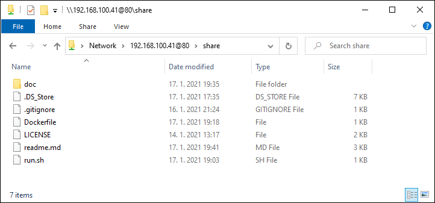
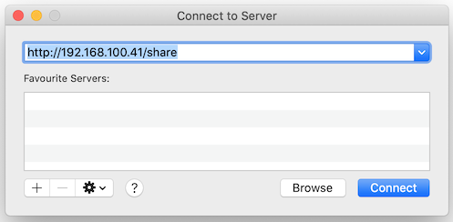

# WebDAV server Docker Image

## Description

Small docker image with WebDAV server based on Alpine linux.

Used to share current directory over anonymous WebDAV on port 80. It is maybe even a simplest / quickest way, how to transfer files between Windows and Mac on your local network.

This image was inspired by great [Docker for Pentesters](https://blog.ropnop.com/docker-for-pentesters/) article.

## Usage

To serve files from your current directory over WebDAV on port 80 run:

```sh
$ docker run --rm -it -p 80:80 -v "${PWD}:/srv/data/share" dhlavaty/webdavhere
```

And now, from Windows, you can browse to the WebDAV share in File Explorer by a UNC path: `\\192.168.100.41@80\share`:



On a Mac, you can `Connect to Server [CMD+K]` directly from Finder. Use address `http://192.168.100.41/share`:




## Convenient usage using alias

Use `webdavhere` alias (in your `zsh.rc` for example):

```sh
alias webdavhere='docker run --rm -it -p 80:80 -v "${PWD}:/srv/data/share" dhlavaty/webdavhere'
```

And now it couldn't be simpler:

```sh
$ cd /Users/myname/subdir
$ httpshere

# done
```

## Docker build

Build image:

```sh
$ docker build . --tag dhlavaty/webdavhere:latest
```

Lint dockerfile:

```sh
$ docker run --rm -i hadolint/hadolint < Dockerfile
```

## License

This project is licensed under MIT - http://opensource.org/licenses/MIT
